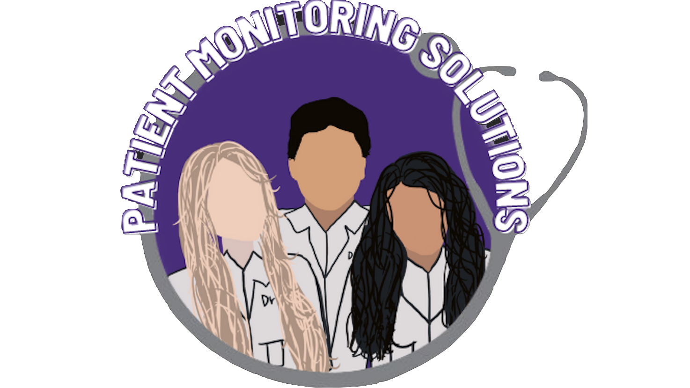

# Patient Monitoring Solutions
###### Benjamin Marin, Suzelle Mejia, Patricia Luis

## Table of Contents
* [Summary](#summary)
* [User Stories](#user)
* [Design Architecture](#design)
* [Demo](#demo)
* [Future](#future)
* [References](#ref)

## Summary
For our final project in EC530[Software Engineering Principles] our team decided
to further develop our patient monitoring app from project 2. We decided to pivot
from Python and make a JavaScript web application We are currently hosting
the app on ......

## User Stories

- [x] Login/Register
  - [x] Have a page to register with name and email
  - [x] Have authentication
  - [x] Have a login page
- [x] UI elements
  - [x] Company Logo
  - [x] Implement Logo on landing page
  - [x] Uniform theme across web Portal
- [ ] Device Module
  - [ ] Convert to JS
  - [ ] Add to database
- [ ] Chat Module
  - [ ] Decide on Architecture
  - [ ] Implement a page for chat
- [ ] Post succesful login page

## Design Architecture

#### Why a Web Portal?
We decided to do a web portal In order to be able to have the highest user base.
On a web portal you can access it on a computer as well as a mobile device unlike
a mobile app in which you are locked into that ecosystem. Also further updates to
the portal would not require a manual update by the user.

Also since we are marketing our product to medical clinics and every clinic has
a computer we came to the conclusion that a web portal would be best for our
clients.

#### Why JavaScript?
We decided to use JavaScript since it would allow us to build a large-scale application
with relative ease. With the added benefits of having tons of open source frameworks and
API's it was an easy choice to choose to use JavaScript.

#### Database
We decide to use Firebase's real time NoSQL database to hold our users data because
it is simple and lightweight. Firebase also reduces development time and some of
our developers had previous experience in it due to Senior Design.

#### Chat Architecture
We decided to use client server architecture for a chat aspect of the application
since P2P interaction seems a bit inappropriate as patients shouldn't be able to
interact with other patients.

We decided to use the chat aspect as more of a virtual secretary for medical offices
where patients can ask questions and make appointments to the office secretaries.

## Demo

## Future
In the future we plan to add more user stories on the medical staff side of things
as we mainly focused on the patient doctor aspect. We could potentially add a chat
feature for doctors/nurses on separate teams and a virtual calendar that schedules
appointments when doctors have free time as well as automatic inventory reordering
for medical supplies.

## References
